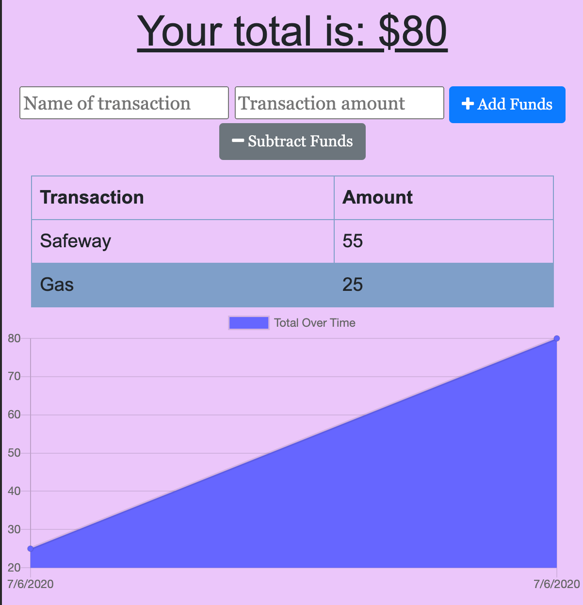
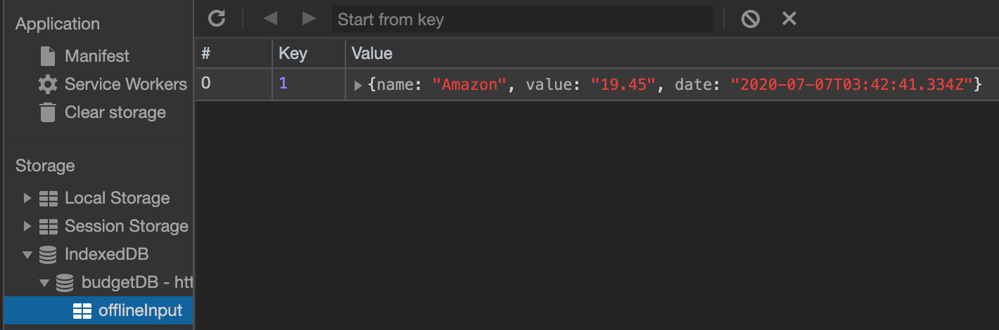

# Project Title: 18_PWA_BudgetTrackers:raised_hands:
- Add functionality to our existing Budget Tracker application to allow for offline access and functionality.:bulb: 
- The user will be able to add expenses and deposits to their budget with or without a connection. When entering transactions offline, they should populate the total when brought back online.
[](https://pwa-18-budgettracker.herokuapp.com/)

[](https://pwa-18-budgettracker.herokuapp.com/)
  ## Table of Contents:
  - [User Story](#user-story-speech_balloon)
  - [Installation](#installation-floppy_disk)
  - [Features](#Features)
  - [NPM Packages](#npm-packages)
  - [Contribution](#contribution-handshake)
  - [Author](#author-bust_in_silhouette)
    - [Name](#author-bust_in_silhouette)
    - [GitHub](#author-bust_in_silhouette)
    - [Email](#author-bust_in_silhouette)
    - [Heroku Deployment](#author-bust_in_silhouette)
  - [License](#license-trophy)
  
  ### User Story :speech_balloon:
  ---
  ```
    AS AN avid traveller
    I WANT to be able to track my withdrawals and deposits with or without a data/internet connection
    SO THAT my account balance is accurate when I am traveling 
  ```
  ---
  ###  Installation :floppy_disk::
  ---
1. Clone this repository.
    ```
    git clone git@github.com:choumrdh/18_PWA_BudgetTrackers.git
    ```
1. Navigate into the cloned directory.
    ```
    cd 18_PWA_BudgetTrackers
    ```
1. Install Nodejs dependencies.
    ```
    npm install
    ```
1. In the root directory of the project, start the server.
    ```
    node server.js
    ```
1. In your browser navigate to the following page.
    ```
    http://localhost:3000
    ```
---
  ### Features
- Offline Functionality:
    > - Enter deposits offline
    > - Enter expenses offline
- When brought back online:
    > - Offline entries should be added to tracker.
--- 
 ### NPM Packages
| Package | Documentation |
| ----------- | ----------- |
| `express` | [Express](https://www.npmjs.com/package/express) |
| `mongoose` | [Mongoose](https://www.npmjs.com/package/mongoose) |
| `morgan` | [Morgan](https://www.npmjs.com/package/morgan) |
| `compression`|[Compression](https://www.npmjs.com/package/compression)|
| `lite-server`|[Lite-server](https://www.npmjs.com/package/lite-server)|


 ### Contribution :handshake: 
 
 [](https://github.com/choumrdh/18_PWA_BudgetTrackers/issues)
  
  #### 	Author :bust_in_silhouette:
   - Name: Michelle [](https://github.com/choumrdh?tab=followers)
  
  > - GitHub: [choumrdh](https://github.com/choumrdh)
  > - email: m.w.chou21@gmail.com
  > - Heroku Deployment: [BudgetTracker](https://pwa-18-budgettracker.herokuapp.com/)
  
 ### License :trophy:
   - [](https://github.com/choumrdh)